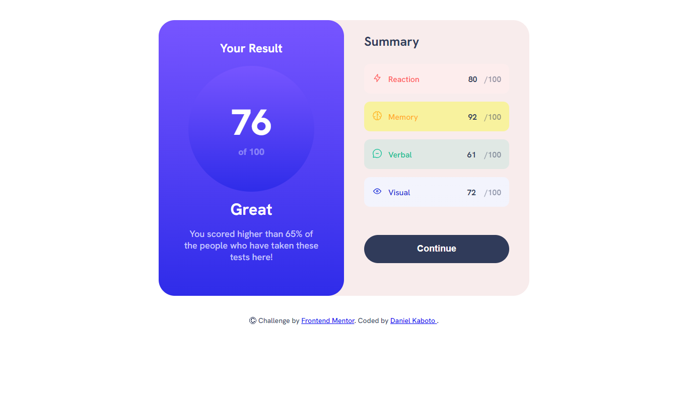

# Frontend Mentor - Results summary component solution

This is a solution to the [Results summary component challenge on Frontend Mentor](https://www.frontendmentor.io/challenges/results-summary-component-CE_K6s0maV). Frontend Mentor challenges help you improve your coding skills by building realistic projects.

## Table of contents

- [Overview](#overview)
  - [The challenge](#the-challenge)
  - [Screenshot](#screenshot)
  - [Links](#links)
- [My process](#my-process)
  - [Built with](#built-with)
  - [What I learned](#what-i-learned)
  - [Continued development](#continued-development)
- [Author
  ](#author)

## Overview

### The challenge

Users should be able to:

- View the optimal layout for the interface depending on their device's screen size
- See hover and focus states for all interactive elements on the page
- **Bonus**: Use the local JSON data to dynamically populate the content

### Screenshot

Mobile view


Desktop view



### Links

- Solution URL:
- Live Site URL: https://sensei-kaboto.github.io/Component/

## My process

### Built with

- Semantic HTML5 markup
- CSS custom properties
- Flexbox
- vanilla JavaScript

### What I learned

In this project, I learned a lot of concepts and enriched my knowledge in areas where I was previously lacking. Here are some of the concepts I have learned through the completion of this project:

* Selectors css:

  The `:nth-of-type` selector allows you select one or more elements based on their source order, according to a formula

  ```
  main div:nth-of-type(1){

  }
  ```

  The adjacent sibling combinator in CSS isn’t a selector on its own, but a way of combining two selectors

```
	.main .category p + p {}
```

* Javascript

here the methods I used to fetch my data store in data.json dynamically  on the Html containers

```
 fetch("data.json")
        .then(response => response.json())
        .then(data => { ................}
```

### Continued development

During this project, I learned the importance of conducting extensive research on CSS selectors and delved into various JavaScript concepts. Additionally, I recognized the value of engaging in more projects to further explore and discover new concepts.

## Author

- Website - Daniel Kaboto
- Frontend Mentor - [@Sensei-Kaboto](https://www.frontendmentor.io/profile/yourusername)
- Twitter - [@](https://www.twitter.com/yourusername)Sensei-kn
